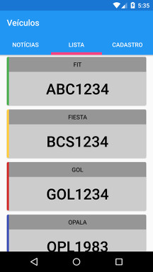
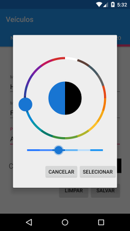

# Android-TabApp
Construir um app android no Android Studio com os recursos listados abaixo.

* Utilização do material design;
* A aplicação deve iniciar com uma animação com logotipos (simulando patrocinadores, ex.: cartolafc);
* Na home, construir uma aplicação com Tabs. Deve conter ao menos 3 abas, e dentro de cada aba diferentes tipos de conteúdos e elementos.

Tela de splash com logo (icone default)

Aba 1 com notícias carregadas da web (feed rss) 

Aba 2 com a lista vazia, mostrando um placeholder default

Aba 2 com lista carregada da base local

Dialog de confirmação de delete dos itens locais (com longClick)

Aba 3 com novo cadastro

Dialog para seleção de cor

Aba 3 com item para ser atualizado (alteração do título)

Dialog de confirmação de update

### Bibliotecas utilizadas
##### Nativas
* [AppCompat] - com.android.support:appcompat-v7:23.0.1
* [Support-v4] - com.android.support:support-v4:23.1.1
* [Design] - com.android.support:design:23.1.1
* [ReciclerView] - com.android.support:recyclerview-v7:23.1.1
* [CardView] - com.android.support:cardview-v7:23.1.1

##### De terceiros
* [EventBus] - de.greenrobot:eventbus:2.4.0
* [PkRSS] - com.pkmmte.pkrss:pkrss:1.1.2
* [Picasso] - com.squareup.picasso:picasso:2.5.2
* [Lobsterpicker] - com.larswerkman:lobsterpicker:1.0.0
* [Realm] - io.realm:realm-android:0.86.0

---
[AppCompat]:https://developer.android.com/tools/support-library/features.html
[Support-v4]:http://developer.android.com/intl/pt-br/tools/support-library/index.html
[Design]:http://android-developers.blogspot.com.br/2015/05/android-design-support-library.html
[ReciclerView]:https://developer.android.com/training/material/lists-cards.html
[CardView]:http://developer.android.com/intl/pt-br/training/material/lists-cards.html
[EventBus]:https://github.com/greenrobot/EventBus
[PkRSS]:https://github.com/Pkmmte/PkRSS
[Picasso]:http://square.github.io/picasso
[Lobsterpicker]:https://github.com/LarsWerkman/Lobsterpicker
[Remal]:https://realm.io
